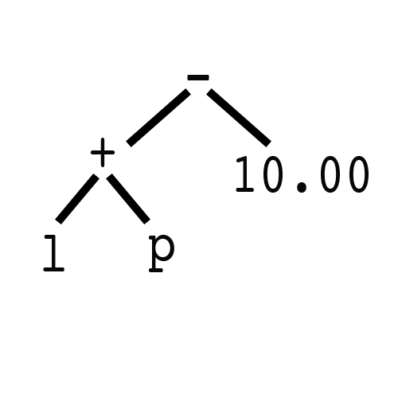

<h1>解释器 Interpreter</h1>

<h3>The problem:</h3>
Our customers at <a href="http://www.yourmechanic.com">YourMechanic</a>  request quotes through our website or through their YourMechanic App. The final price for a quote is a combination of two variables, the cost of parts and the cost of labor. We want the ability to apply specific adjustments to either parts or labor prices. These adjustments could come from coupons, warranty claims or contests. We need a simple language that can express these custom adjustments. For example, we should be able to define an expression that can add a 20% discount for parts. Or a another code that reduces $10 on labor.  Or one that does both.
YourMechanic的客户通过我们的网站或通过他们的YourMechanic应用程序请求报价。 报价的最终价格是两个变量的组合，即零件成本和劳动力成本。 我们希望能够对零部件或劳动力价格进行特定的调整。 这些调整可能来自优惠券，保修索赔或竞赛。 我们需要一种可以表达这些自定义调整的简单语言。 例如，我们应该能够定义一个可以为零件添加20％折扣的表达式。 或者另一个可以减少10美元的代码。 或者两者兼而有之。

<h3>The solution:</h3>

We will define a simple language for adjustments. We will have a set of rules that will cover addition, subtraction, multiplication and division. We will also define two variables that our language will map for parts and labor prices. Once the language is defined, our users can express adjustments through a string that abides by our grammar. For example, to subtract $10 dollars from parts we would use:
我们将定义一个简单的语言进行调整。 我们将有一套规则，将包括加法，减法，乘法和除法。 我们还将定义我们的语言将为零件和劳动力价格绘制的两个变量。 一旦语言被定义，我们的用户可以通过一个遵守我们的语法的字符串来表达调整。 例如，要从零件中减去$ 10美元，我们将使用：
```swift
var expression = "l + p - 10.00"
//adjustment: total price is labor + partsPrice - $10
```
<!--more-->

Before we begin, let's understand what we need to build. To be able to parse a string and interpret it as a mathematical function, we need to define a set of rules and objects. By looking at our problem a few items pop out:
在开始之前，让我们明白我们需要建立什么。 为了能够解析字符串并将其解释为数学函数，我们需要定义一组规则和对象。 通过查看我们的问题，几个项目弹出：

* Numbers: like $10 or 15%
* Variables: placeholders for cost of labor and parts 劳动力和零件成本的占位符
* Operations: +, -, * or / that will define the operation between numbers and or variables.

Although these objects have their own meaning and interpenetration, they share one important property. They are expressions that need to be interpreted by our language. Therefore we begin by defining a protocol. A protocol that will be implemented by all our expressions
虽然这些对象有其自身的意义和相互渗透，但它们共享一个重要的属性。 它们是需要用我们的语言来解释的表达。 所以我们从定义一个协议开始。 一个将被我们所有表达式实现的协议

```swift
protocol Expression {
  func interpret(variables: [String:Expression]) -> Double
}
```
This protocol has one function called interpret. It will take a dictionary of expressions and returns a double. We will explain why there is a variables dictionary in a bit but the rest of the protocol should make sense. As mentioned earlier every expression will need a function to interpret it. The final value we expect to get from our expression is a double. For our atomic objects like numbers and variables, this will be their raw values. For composite expressions like addition and subtraction, this will be the result of the operation. 
这个协议有一个叫做interpret的函数。 这将需要一个表达式字典，并返回一个双。 我们将解释为什么会有一个变量字典，但协议的其余部分应该是有意义的。 如前所述，每个表达式都需要一个函数来解释它。 我们期望从我们的表达中获得的最终价值是双重的。 对于像数字和变量这样的原子对象，这将是它们的原始值。 对于像加法和减法这样的复合表达式，这将是操作的结果。
This might seem a bit counter intuitive right now, but as we define our expressions it will become more clear. Lets begin by defining our number expressions:
这可能看起来有点不合时宜，但是当我们定义我们的表达式时，它会变得更加清晰。 让我们开始定义我们的数字表达式
```Swift
class Number: Expression {}
```

Our Number expression is a simple class that implements the Expression protocol. It has a value property of type double. This will be the value of the number represented by the number expression. We have a simple initializer that sets that value. We also have our interpret function that makes our number class conform to the Expression protocol. Interpreting a number is rather simple. It's the number itself. Our language will treat "12" as 12 and "0.14" as 0.14. Our Interpret function will return the number itself.
我们的数字表达式是一个实现了表达式协议的简单类。 它具有double类型的值属性。 这将是数字表达式所表示的数字的值。 我们有一个简单的初始化程序来设置这个值。 我们也有我们的解释功能，使我们的号码类符合表达协议。 解释一个数字相当简单。 这是数字本身。 我们的语言会把“12”当作12，把“0.14”当作0.14。 我们的解释函数将返回数字本身。
Lets make things a bit more interesting. Numbers on their own don't really help us that much. We need a way to be able to add, subtract, multiply and divide them. These actions can also be defined as Expressions. Lets look at what we have for addition
让事情变得有趣一点。 数字本身并不能真正帮助我们。 我们需要一种能够加，减，乘和除的方法。 这些操作也可以定义为表达式。 让我们看看我们有什么补充
```swift
class Add: Expression {}
```

Unlike numbers, addition is a composite expression. This makes sense since in addition we need two expression to apply the add operation. So here is how we define our Add class. Much like our number class our Add class will implement the Expression protocol. However unlike our number class Add will have two expressions instead of a double as its internal values. We will define a leftOperand and a rightOperand which will be two other expressions. Now these expressions can be Numbers or other Add expressions. But since they implement the Expression protocol, their interpreter function will give us a double. And we know how to add two doubles. In fact that will be the definition of our Add class interpret class. It will be the interpretation value of its left operand added to the interpretation of its right operands. Addition of a double with another double is a double. We will return that value as the interpreted value of our Add expression.
与数字不同，加法是一个复合表达式。这是有道理的，因为此外我们需要两个表达式来应用添加操作。所以这里是我们如何定义我们的Add类。就像我们的数字类一样，我们的Add类将实现Expression协议。然而，与我们的数字类不同，Add将具有两个表达式而不是一个double作为其内部值。我们将定义一个leftOperand和一个rightOperand，这将是另外两个表达式。现在这些表达式可以是数字或其他添加表达式。但是，由于他们实现了表达式协议，他们的解释功能会给我们一个双重的。而且我们知道如何增加两个双打。实际上这将是我们的Add类解释类的定义。它的左操作数的解释值将被添加到对其右操作数的解释中。另外一个double的加法是double。我们将返回该值作为我们的Add表达式的解释值。
We can follow the same pattern for subtraction, multiplication and division. We simply change our interpret function on each class to reflect the required operation.
我们可以遵循相同的减法，乘法和除法的模式。我们只是改变我们对每个类的解释功能，以反映所需的操作。
```Swift
class Subtract: Expression {}

class Multiply: Expression {}

class Divide: Expression {}
```
One thing remains unanswered. Why are we passing a variable dictionary through our expressions, yet none of our defined expressions have used it so far. As mentioned earlier we need a way represent the value associated with price of parts and price of labors. These values will be stored in a variables dictionary. Each one of them will map to a defined variable in our expression. For example, lets look at the expression we mentioned earlier
有一件事情没有得到答复。 为什么我们要通过我们的表达式传递一个变量字典，但是迄今为止我们定义的表达式都没有使用它。 如前所述，我们需要一种方式来表示与零件价格和劳动力价格相关的价值。 这些值将被存储在变量字典中。 它们中的每一个都将映射到我们表达式中的已定义变量。 例如，让我们看看我们前面提到的表达式
```swift
var expression = "l + p - 10.00"
```

We see five expressions:
1. A variable expression that hold the value of labor costs "l" 一个变量表达式，保留劳动力成本的价值“l”
2. An addition expression which will add the labor variable expression to the parts variable expression 增加一个表达式，将劳动变量表达式添加到部分变量表达式中
3. A variable expression that will hold the value of parts cost "p" 一个变量表达式将保存零件成本值“p”
4. A subtract expression which will subtract the number expression on the right from the result of the add expression on the left 从左边的加法表达式的结果中减去右边的数字表达式的减法表达式
5. A number expression which will hold the value 10.00 一个数字表达式，将保存值10.00

Our language needs a way to map these variables (l and p) to their respective values. This is where we use our variables dictionary. Lets define our last expression.
我们的语言需要一种将这些变量（l和p）映射到它们各自的值的方法。 这是我们使用我们的变量字典的地方。 让我们定义我们最后的表达。
```Swift
class Variable: Expression {}
```

Our variable expression is a string (either 'l' for labor or 'p' for parts) that needs to map to a value. Since we have our variables dictionary in our interpret function we can look up its expression and return its interpretation. If there are no values defined for that variable we will return zero.
我们的变量表达式是一个字符串（'l'表示劳动力，'p'表示部分）需要映射到一个值。 由于我们在我们的解释函数中有我们的变量字典，所以我们可以查找它的表达式并返回它的解释。 如果没有为该变量定义的值，我们将返回零。
We have now defined our language. There are two atomic expressions: numbers and variables. We also have four composite expressions that handle addition, subtraction, multiplication and division. 
我们现在定义了我们的语言。 有两个原子表达式：数字和变量。 我们也有四个复合表达式来处理加法，减法，乘法和除法。
Our work is not over yet. It's one thing to be able to define a language and set its grammar. But it's useless if we don't have any means of parsing it and applying its result to our quotes. 
我们的工作还没有结束。 能够定义一种语言并设定其语法是一回事。 但是，如果我们没有任何解析方法并将其结果应用到我们的引用中，那就没用了。
Lets define one last expression. We will call it the evaluator. This expression will take in a string and will parse it according to the rules we set for our language. It's going to get a bit complicated from here on so we're going to break this down and approach it step by step. 
让我们定义一个最后的表达式。 我们将其称为评估者。 这个表达式将采用一个字符串，并根据我们为我们的语言设置的规则解析它。 从这里开始会变得有点复杂，所以我们要分解这个问题，一步一步来解决问题。
```swift
class Evaluator: Expression {}

```

Our evaluator expression, much like addition and subtraction, is a composition of one or more expressions. We first define a root expression called syntaxTree. We will set this expression to be equal to a Number expression with a value zero by default. We also define a expression property of type string which will be the string input, defining our expression. Why do we call our original expression 'syntaxTree'? If we look at our sample expression from the beginning we see that it breaks down into a tree:
我们的评估者表达式，就像加法和减法一样，是一个或多个表达式的组合。 我们首先定义一个名为syntaxTree的根表达式。 我们将这个表达式设置为等于默认值为零的数字表达式。 我们还定义了一个字符串类型的表达式属性，它将是字符串输入，定义我们的表达式。 为什么我们称之为原始表达式“syntaxTree”？ 如果我们从一开始就看样本表达式，我们会看到它分解成一棵树：
```swift
var expression = "l + p - 10.00"
```

If we move from left to right and parse our expression one item at a item we should end up with the following tree:


Once we have this tree, calling interpret on our root expression (- in this case) will return the value we seek. If you are unsure on why that is the case, I recommend going over our expression definitions.
一旦我们有了这棵树，调用我们的根表达式（在这种情况下）的解释将返回我们所寻求的值。 如果您不确定这是为什么，我建议您检查一下表达式的定义。
How do we build this tree? 

```swift 
 import Foundation
 private func buildSyntaxTree() {}

 private func getNextExpression(items: [String], index: Int) -> Expression {
    let next = items[index + 1]
    var nextExpression: Expression
    if let doubleValue = next.doubleValue {
      nextExpression = Number(value: doubleValue)
    } else {
      nextExpression = Variable(name: next)
    }
    return nextExpression
  }
 ```
 
 We first start by declaring a Stack of type expression. If you copy past this code into your project as is, Swift compiler will complain "Use of unresolved identifier 'Stack'. That's because Swift currently does not ship with a generic Stack data structure. If you are unfamiliar with Stacks, [please review this](https://en.wikibooks.org/wiki/Data_Structures/Stacks_and_Queues). 
 我们首先声明一个Stack类型表达式。 如果你把这段代码复制到你的项目中，Swift编译器会抱怨“使用未解析的标识符堆栈”，这是因为Swift目前没有提供一个通用的Stack数据结构。
Lucky for us, building a generic Stack data structure is rather trivial in Swift. I don't want to get too far into it but feel free to research it if you wish. Here is the code that provides us with a simple Stack.
对我们来说幸运的是，在Swift中构建一个通用的Stack数据结构是相当微不足道的。 我不想太过分，但如果你愿意的话可以随意研究。 以下是为我们提供简单堆栈的代码。
```Swift
struct Stack<T> {}
```

Next we split our string expression by spaces. Our expression is now  `["l", "+", "p", "-", "10.00"]`. Make sure you have `import Foundation` at the beginning of the class definition.
接下来，我们用空格分隔字符串表达式。我们的表达现在是'[“l”，“+”，“p”，“ - ”，“10.00”]。确保在类定义的开头有`import Foundation`。
Next we loop through our items in our now separated expression array and deal with each case by case. We define a switch statement, that on operation expressions like '+' and '-' where we need the expression before and the one after does the following:
接下来，我们通过我们现在分开的表达式数组中的项来循环处理每个case。我们定义了一个switch语句，就像我们在前面需要表达式的操作表达式那样，在“+”和“ - ”之间，后面的表达式做如下操作：
* We grab the left operand by popping the stack which would hold the last value we processed. 我们通过弹出堆栈来获取左操作数，该堆栈将保存我们处理的最后一个值。
* We grab the right operand by processing the next item using the `getNextExpression` and setting the index to account for the move. 我们通过使用getNextExpression处理下一个项目来获取右操作数，并设置索引来考虑移动。

It is important to note that we assume that our expression text is valid. That between every operation expression is either a number or variable expression. This makes sense since something like "12 + 5 - +" or "12 5" doesn't mean anything in our language definition. There are no specific error checks in place right now and we can leave that as an exercise. For our case, we assume the input expression is valid. 值得注意的是，我们假设我们的表达文本是有效的。每个操作表达式之间的数字或变量表达式。这是有道理的，因为像“12 + 5 - +”或“12 5”在我们的语言定义中没有任何意义。目前没有具体的错误检查，我们可以将其作为一个练习。对于我们的情况，我们假设输入表达式是有效的。

At then end we assign the last item we processed in our stack to our syntax tree. The last item in our stack will be the root of our syntax tree. Now that we have our syntax tree it seems like we are done. We can pass our tree to our interpret function and have it calculate the final value for our quote price. 
最后，我们将我们堆栈中处理的最后一个项目分配给语法树。我们堆栈中的最后一项将是我们的语法树的根。现在我们有了我们的语法树，好像我们已经完成了。我们可以将我们的树传递给我们的解释函数，并计算我们报价的最终价值。
Not so fast...

We have a problem. If you remember from grade school, order of operations dictates we calculate multiplications and divisions before addition and subtraction. Right now our tree will process from left to right. If our expression has only addition and subtraction or only multiplication and division, it will work correctly. However for the following expression:
我们出现了问题。 如果你还记得小学的时候，操作的顺序要求我们在加减之前计算乘法和除法。 现在我们的树会从左到右处理。 如果我们的表达式只有加减乘除，或者只是乘除，它才能正确的工作。 但是对于下面的表达式
```swift
var expression = "5.00 + 10.00 * 2.0"
```

Our evaluator will return 30.00. This is incorrect, we know that answer is 25.00. How do we deal with order of operations? How do we get our evaluator to process multiplication and division before addition and subtraction. My favorite approach is to split our expressions on '+' and '-' first. For the example, the above expression would be broken down into "5.00" and "10.00 * 2.0". The sub expressions will be of the same operation order and can be calculated from left to right. We will then end up with "5.00" and "20.00", which we can merge back and end up with "5.00 + 20.00". We can now process this expression and end up with the correct answer: 25.00
我们的评估者将返回30.00。 这是不正确的，我们知道答案是25.00。 我们如何处理操作的顺序？ 我们如何让我们的评估者在加减之前处理乘法和除法。 我最喜欢的方法是首先在“+”和“ - ”之间分割我们的表达式。 例如，上面的表达式将被分解为“5.00”和“10.00 * 2.0”。 子表达式将具有相同的操作顺序，可以从左到右进行计算。 然后我们会以“5.00”和“20.00”结束，我们可以合并到“5.00 + 20.00”。 我们现在可以处理这个表达式，并以正确的答案结束：25.00
Let's see how this done:

```Swift
 func interpret(variables: [String : Expression]) -> Double {}
  private func parseoutAdditionsAndSubtractions(input: String) -> [String] {}
}
```
We define our interpret function by first checking to see if we need to worry about order of operations. If our expression has "+" or "-" and "\*" or "/" then we have to ensure correct order of operations.  We start by parsing out addition and subtraction elements. Our function `parseoutAdditionsAndSubtractions` will return ["5.00", "+", "10.00 \* 2.0"] for "5.00 + 10.00 * 2.0"
我们首先检查我们是否需要担心操作的顺序来定义我们的解释功能。如果我们的表达式有“+”或“ - ”和“\ *”或“/”，那么我们必须确保正确的操作顺序。我们首先解析出加法和减法元素。我们的函数`parseoutAdditionsAndSubtractions`将返回“5.00 +”，“+”，“10.00 \ * 2.0”，“5.00 + 10.00 * 2.0”
We then go through each item, if it's '+' or '-' we will concatenate it to our newExpression. Otherwise we evalute its value and concatenate it to our new expression. Once our newExpression is built, in this case it will be "5.00 + 20.00" we will evaluate it and return it. 
然后我们通过每个项目，如果它是'+'或' - '，我们将它连接到我们的新表达式。否则，我们评估它的价值，并将其连接到我们的新表达式。一旦我们的newExpression建立，在这种情况下，它将是“5.00 + 20.00”，我们将评估并返回它。
If our expression doesn't need to worry about order of operations. We will just build our syntaxTree and interpret it.
如果我们的表达不需要担心操作的顺序。我们将构建语法树并对其进行解释。
This class can be a little overwhelming. I suggest downloading the repo and stepping through a few examples to get a good feel for how it works. 
这个类可以有点压倒性的。我建议下载回购和通过几个例子，以获得良好的感觉如何工作。
So now that we have our language defined, our expressions fleshed out and a working evaluator in place lets see it in action. 
所以现在我们已经定义了我们的语言，我们的表达式被充实了，一个正在工作的评估者可以看到它在行动中。

First lets define our Quote class. 
首先让我们定义我们的报价类。

```Swift
import Foundation

class Quote {}
```

Our Quote class will have three properties. One for price on parts, another for price on labor and at last a string that will conform to our language and sets the total price called adjustments. We initialize these properties in our initilizer. 
我们的报价类将有三个属性。 一个是零件价格，另一个是劳动力价格，最后是一个符合我们语言的字符串，并设置总调价价格。 我们初始化这些属性在我们的initilizer。
We will define our totalPrice property as a computed property. If we have an adjustment we will create our variable dictionary. We will assign the labor price as a number expression to 'l' and the parts prices to 'p'. We will create an evaluator expression using the adjustment string and return its interpreted value by passing our dictionary into it. 
我们将把totalPrice属性定义为一个计算属性。 如果我们有一个调整，我们将创建我们的可变字典。 我们将劳动力价格作为数字表达式分配给“l”，零件价格分配给“p”。 我们将使用调整字符串创建一个评估表达式，并通过将其字典传递给它来返回其解释值。
If we do not have an adjustment defined for our quote, we will return parts price + labor price as expected. 
如果我们没有为报价定义调整，我们将按照预期返回零件价格+劳动力价格。
Let's test some cases, in main.

Running these will return the following

```
65.0
135.0
180.0
175.5
166.5
152.0
6525.0
```

We see that our language definition is working as expected. We see that our evaluator parses our adjustment string correctly and the correct value is calculated. We also see that order of operation is honored and that we can now define complex adjustment for our quote object with ease. 
我们看到，我们的语言定义正在按预期工作。我们看到我们的评估人员正确分析我们的调整字符串，并计算出正确的值。我们也看到，操作顺序很荣幸，现在我们可以轻松地为我们的报价对象定义复杂的调整。
Congratulations you have just implemented the Interpreter Design Pattern to solve a nontrivial problem.
恭喜你已经实施了解释器设计模式来解决一个不小的问题。
See if you can find ways to improve its design, Add more complex functionalities. Here are some suggestions on how to expand or improve on the project:
看看你是否能找到改进设计的方法，添加更复杂的功能。以下是关于如何扩展或改进项目的一些建议：
* A new price for cost of gas needs to be added to the total price. Define a variable 'g' for this cost in our language. 需要在总价格中增加新的天然气成本价格。用我们的语言定义一个变量“g”代表这个成本。
* We assume our adjustment input is correct, add descriptive error checking for our parser. 我们假设我们的调整输入是正确的，为我们的解析器添加描述性错误检查。
* The process used for honoring order of operations in this solution is simple but not efficient. How can we improve on it? 此解决方案中用于遵守操作顺序的过程很简单，但效率不高。我们该如何改进呢？
* Add parenthesis to our language  添加括号到我们的语言


We also defined a few extension in this project that I didn't explain in details because I felt it distracted from an already complicated explanation of the interpreter design pattern. They are included in the repo but if you're reading the code and you see calls to functions that you haven't seen before they are most likely defined as an extension.
我们还在这个项目中定义了一些我没有详细解释的扩展，因为我觉得这个解释器设计模式的复杂解释已经分散了。 它们包含在回购协议中，但是如果您正在阅读代码，并且您看到了对您之前没有见过的函数的调用，那么它们很可能被定义为扩展。
